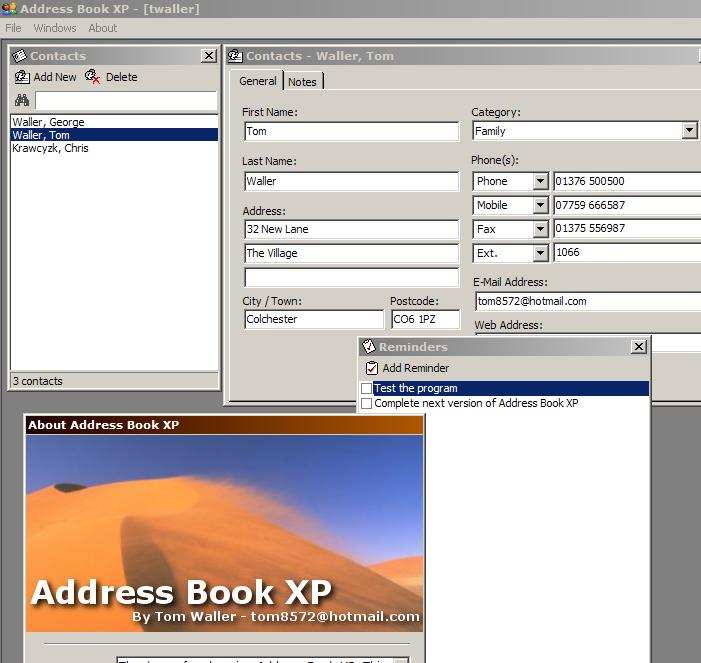



## Address Book XP

### Description

Address Book XP is a contact management and address book organiser. This program currently supports user logins, reminders and some advanced uses of Access XP and 2000. This code was designed for Windows XP with Office XP or 2000. It hasn't been tested on other machines yet but hopefully you guys and girls will be able to help with that. There is a lot of work that needs to be done with this code such as a suitable search engine and some user managemet. If you feel you can add to my program, please be my guest, as long as you mention my name somewhere in there. Comments will be greatly appreciated. Tom
 
### More Info
 

             |
---                |---
**Submitted On**   |2002-03-18 23:27:26
**By**             |[Tom Waller](https://github.com/Planet-Source-Code/PSCIndex/blob/master/ByAuthor/tom-waller.md)
**Level**          |Intermediate
**User Rating**    |4.4 (53 globes from 12 users)
**Compatibility**  |VB 6\.0
**Category**       |[Databases/ Data Access/ DAO/ ADO](https://github.com/Planet-Source-Code/PSCIndex/blob/master/ByCategory/databases-data-access-dao-ado__1-6.md)
**World**          |[Visual Basic](https://github.com/Planet-Source-Code/PSCIndex/blob/master/ByWorld/visual-basic.md)
**Archive File**   |[Address\_Bo631973182002\.zip](https://github.com/Planet-Source-Code/tom-waller-address-book-xp__1-32798/archive/master.zip)

